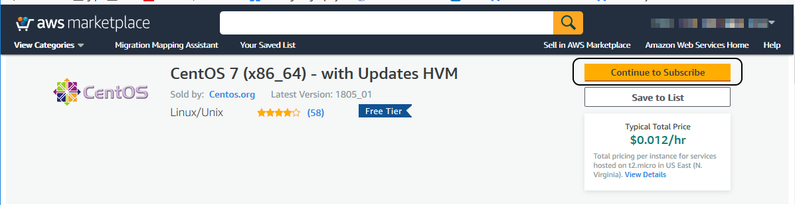
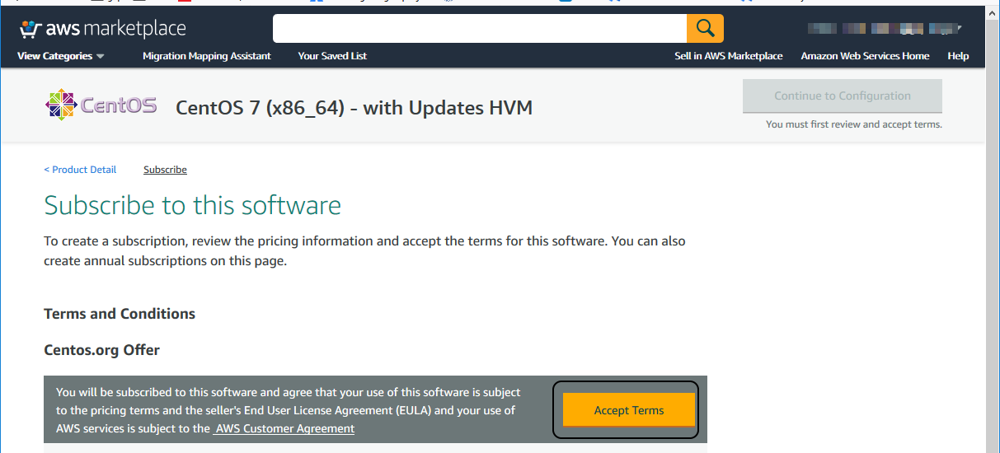
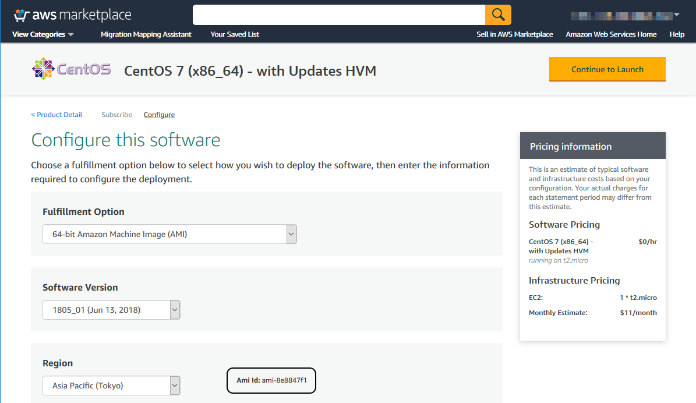

# VagrantとPackerによるインフラ開発環境の構築

## VagrantとVagrantfile

Vagrantは、開発環境の用途として仮想マシンを構築し、管理するためのミドルウェアです。 
Mitchell Hashimoto氏がオープンソース(MIT License)で開発し、彼とArmon Dadgar氏が創立したHashiCorp社によってサポートが行われています。

Vagrantでは、`Vagrantfile`というファイルに仮想マシンの設定を配置します。`Vagrantfile`はRubyの文法で
記述する設定ファイルです。通常インフラ自動化においてVagrantを使用する場合は、`Vagrantfile`の配下のディレクトリーに、プロビジョニングに必要なスクリプト等を格納します。


## バージョン管理からのVagrantfileの取得と仮想マシンの作成

以下に本書のサンプルコード([https://github.com/azusa/techbookfest5-vagrant](https://github.com/azusa/techbookfest5-vagrant))から`Vagrantfile`を取得し、
VirtualBox上にAnsibleを用いてサーバーサイド開発のベースとなる
仮想マシンを構築する手順を示します。なお本章ではこの後、このサンプルコードに
従って説明を進めます。

バージョン管理から`Vagrantfile`が含まれるレポジトリーを取得し、`vagrant up`コマンドで仮想マシンを起動し、プロビジョニングを行います。([@lst:code_020_code020])


```{#lst:code_020_code020 caption="vagrant up"}
git clone https://github.com/azusa/techbookfest5-vagrant
cd techbookfest5-vagrant
vagrant up
```

仮想マシンの作成後に、AnsibleのPlaybook等でのVMの構成が
変更になった場合は、`git pull`コマンドで変更内容を取得し、
`vagrant provision`コマンドでプロビジョニング処理を実行します。([@lst:code_020_code030])

```{#lst:code_020_code030 caption="vagrant provision"}
git pull origin master
vagrant provision
```

VMの再起動は`vagrant reload`コマンド、終了は`vagrant halt`コマンドで行います。([@lst:code_020_code040])

```{#lst:code_020_code040 caption="vagrant reload / vagrant halt"}
# 再起動
vagrant reload
# 終了
vagrant halt
```

VMを破棄する場合は`vagrant destroy`コマンドを実行します。([@lst:code_020_code050])

```{#lst:code_020_code050 caption="vagrant destroy"}
vagrant destroy
```

## .vagrant

`Vagrantfile`の配下に出来る`.vagrant`ディレクトリーは、環境ごとの仮想マシンの情報が含まれるので、バージョン管理に格納する場合は[@lst:code_020_code010]のように`.gitignore`に含めてバージョン管理から除外します。

```{#lst:code_020_code010 caption=".gitignore"}
.vagrant
```
## Vagrantのボックスの仕様

Vagrantでは、Vagrantbox.es ([https://www.vagrantbox.es/](https://www.vagrantbox.es/)) でボックスが公開されていますが、仮想マシンの構成の仕様が明文化されていないboxも存在します。

このため、VagrantのBoxを、Infrastructure as Codeのベースとして使用するには、ボックス内のVMのOSがどのような構成で構築されているかを、厳密に管理する必要があります。

この場合、VagrantのBoxを、Vagrantの仕様にのっとり、OSをセットアップするところからはじめることになります。

VagrantのBoxを作成するにあたっての仕様は、以下のURLで公開されています。

- [https://www.vagrantup.com/docs/boxes/base.html](https://www.vagrantup.com/docs/boxes/base.html)

主な仕様は、次の通りです。

- ユーザー: `vagrant`がパスワード`vagrant`でログインできること
- rootのパスワードは `vagrant` であること
- `vagrant` ユーザーがパスワードなしでsudoできること

また、VMイメージのファイルサイズの縮小のため、仮想ハードディスクの領域をエクスポートする前に`/dev/zero`でクリアすることが望ましいです。他にも、RedHat 6 / CentOS 6 の場合は、ネットワークインターフェースのMacアドレスの情報が保存されないように、`/etc/udev/rules.d/70-persistent-net.rules`をディレクトリーにしておくなどの手順が必要になります。

Vagrantのボックス作成はVirtualBox等の仮想マシンで手動でOSをセットアップした後、`vagrant package` コマンドで仮想マシンのイメージをエクスポートすることでも行えますが、`vagrant package`コマンドを使用した場合はOSのアップデートごとにこのような手動の作業を繰り返すことになります。

### Windows10とVirtualBoxとVagrantの微妙な関係

VagrantのBoxには、動作するVirtualBoxのバージョンに応じたVBoxGuestAdditionsが仮想マシン上のゲストOSにインストールされている必要があります。

ところで、マイクロソフト社のWindows10では「Windows as a Service」というコンセプトに基づき、数年ごとにWindowsの新しいバージョンをデリバリーするリリースサイクルから、年に２～3回、小規模な機能更新が提供されるリリースサイクルが採用されました。

このリリースサイクルの変更により、VirtualBoxがWindows側の仕様変更の影響を受け、VirutalBoxのバージョンアップが必要になる場合があります。

そしてVirtualBoxのバージョンがあがるということはVBoxGuestAdditionsの再インストールが必要となり、これまで使用していたBoxがそのままでは使用できなくなり…ということが、これまでのWindows10の機能リリースでは続いています。

VirtualBoxのバージョンアップにVagrantのBoxを追従するには、vagrant-vbguestの`vagrant vbguest`コマンドでVBoxGuestAdditionsを更新するか、VBoxGuestAdditionsを更新したVagrantのBoxを作成するかのいずれかになります。

また、VboxguestAdditionのインストールには、RPMだとkernel-develのような、Linux Kernelの開発者向けのパッケージがインストールが必要です。VirutalBoxのバージョンアップ時に、ゲストOSのパッケージの更新が行われていない状態だと、
これらのVboxguestAdditionの必須パッケージがインストールできず、VboxguestAdditionの更新に失敗する場合があります。この場合はVboxguestAdditionの更新の前に、ゲストOSのシステムを更新する必要があります。

これらの問題を踏まえて、開発の現場でVagrantを用いたローカル開発環境の運用を継続的に行うためには、
この本で取り上げるPackerを使用して、ボックスの更新とその配付の仕組みを作り込む必要があります。

## Packer

Packerは複数プラットフォームの仮想マシンのイメージ構築をコード化するプロダクトです。Hashicorpによって開発され、オープンソース(Mozilla Public License 2.0)で公開されています。

## Packerの導入

PackerはGoで開発されており、単一バイナリーで提供されています。Packerを導入するには、[https://www.packer.io/downloads.html](https://www.packer.io/downloads.html) から、プラットフォームにあわせたアーカイブをダウンロードし、展開した中にあるファイルを環境変数`PATH`の通ったディレクトリーに配置し、パーミッションを適切に設定します。

## /usr/sbin/packerとのpackerコマンドの衝突

パスワード強度チェックツールのcracklib ([https://github.com/cracklib/cracklib](https://github.com/cracklib/cracklib)) のRPMパッケージには、`/usr/sbin/packer` という `cracklib-packer` コマンドへのシンボリックリンクが存在します。環境変数`PATH`の参照順序によっては、`packer` コマンドの呼び出し時にcracklibの`packer`コマンドが呼び出されることがあります。

対処としては、環境変数の`PATH`の設定で、`Packer`の`packer`コマンドが先に呼び出されるようにするか、フルパスで`packer`コマンドを実行する必要があります。

## PackerとBoxcutterによるベースイメージの作成

Packerを使用して、Vagrantなどの仮想環境でのOSをセットアップする手順をテンプレート化したプロダクトがBoxcutterです。BoxcutterはGitHubでオープンソース(Apache License 2.0)で公開 ([https://github.com/boxcutter](https://github.com/boxcutter)) されています。BoxCutterはChef社出身で、現在はAppleで自動化に関わるエンジニアであるMischa Taylor氏が中心となってメンテナンスしています。


## Boxcutterの設定ファイル

Packerは、構成のテンプレートをjson形式で記述します。BoxcutterのCentOSのレポジトリー([https://github.com/boxcutter/centos](https://github.com/boxcutter/centos))では、`centos.json`です。

## 変数

Packerでは、テンプレートをビルドする際に、パラメーターをユーザー変数(User Variables)として渡すことができます。

ユーザー変数を渡す方法には、

- コマンドライン引数
- JSON形式のファイル

の二通りの方法があります。

BoxcutterではJSON形式のファイルでユーザー変数を定義する方法を採用しており、そのファイルは `centos7.json`ないし`centos6.json`となります。([@lst:code_020_code060])

```{#lst:code_020_code060 caption="packer build"}
packer build -only=virtualbox-iso -var-file=centos7.json centos.json
```

## Boxcutterのビルドの高速化

Packerは、OSのインストールのためのisoファイルを初回のビルドにダウンロードします。CentOSのテンプレート内で指定されている`mirros.sonic.net`は日本国内にエッジサーバーが存在しないため、デフォルトの指定ではisoファイルのダウンロードに時間がかかります。

ダウンロードを高速化するためには、変数指定されている`centos7.json`ないし`centos6.json`内の`iso_url`ならびに`iso_checksum`の項目を日本国内のミラーサイトのURLならびにチェックサムに修正します。([@lst:code_020_code070])


```{#lst:code_020_code070 caption="centos7.jsonの修正例"}
{
 (略)
  "iso_checksum": "506e4e06abf778c3435b4e5745df13e79ebfc86565d7ea1e128067ef6b5a6345",
  "iso_checksum_type": "sha256",
  "iso_url": "http://ftp.riken.jp/Linux/centos/7.5.1804/isos/x86_64/CentOS-7-x86_64-DVD-1804.iso",
 (略)
} 
```


## Vagrantとプロビジョニングツールとの連携

Vagrantには、プロビジョニングの仕組みの中でChefやAnsibleなど、プロビジョニングツールと連携する仕組みがあり、Vagrantによる仮想マシンの起動時にプロビジョニングの処理を実行することができます。

しかし、Vagrantによるプロビジョニング処理の実行は、実際にサーバーをセットアップする時と異なるインターフェースやパラメーターで処理を行う事になり、本番環境の実機のセットアップ時に見落としていた問題が発生しがちです。

Vagrantによるプロビジョニングと、実機のプロビジョニングで、構成を揃えるためには、VagrantのShell Provisioner ([https://www.vagrantup.com/docs/provisioning/shell.html](https://www.vagrantup.com/docs/provisioning/shell.html)) の仕組みを使用し、Vagrantから実行するときと実機で実行するときで、同一のシェルスクリプトを実行するようにします。


VagrantのShell Provisionerを実行する際、`Vagrantfile`で指定したスクリプトは`/tmp`にアップロードされて実行されます。デフォルトだとAnsibleのplaybookを格納したワークスペースはゲストOSの`/vagrant`配下にマウントされています。Vagrantからシェルスクリプトを介してプロビジョニングツールを実行する場合は、[@lst:code_020_code080]の`provisioning-vagrant.sh`の処理内でカレントディレクトリーを`/vagrant`に切り替えて実行します。実機でのプロビジョニング時は、[@lst:code_020_code090]の`provisioning.sh`の処理内で、実行するスクリプトのあるディレクトリー上にカレントディレクトリーを切り替えて実行します。

```{#lst:code_020_code080 caption="provisioning-vagrant.sh"}
cd /vagrant
bash provisioning.sh
```

```{#lst:code_020_code090 caption="provisioning.sh"}
yum -y install ansible

CURRENT=$(cd $(dirname $0) && pwd)
cd $CURRENT

PYTHONUNBUFFERED=1 ANSIBLE_FORCE_COLOR=true ansible-playbook \
  --limit="default" --inventory-file=localhost -v provision/localhost.yml
```


なお、Windows上で実行するVagrantでShell Provisionerを使用してシェルスクリプトを実行する場合は、ローカルにバージョン管理システムからチェックアウトした環境上で、シェルスクリプトの改行コードが`LF`になっている必要があります。

Git for Windowsのデフォルト設定ではチェックアウト(`git clone`)時に改行コードを`CRLF`に変換するようになっているため、[@lst:code_020_code100]の`.gitattributes`で改行コードを`LF`としてチェックアウトするように設定します。

```{#lst:code_020_code100 caption=".gitattributes"}
* eol=lf
```


## Vagrantfile内でのイメージの指定

Packerで作成したボックスを開発チームに配布するには、ボックスのファイルをhttpでアクセス可能な場所に
配置し、そのURLをVagrantfileの`vm.box_url`に指定します。([@lst:code_020_code110] )

```{#lst:code_020_code110 caption="vm.box_urlの指定"}
 vm.box_url="http://manage.fieldnotes.jp/images/centos7-7.5.1804-1.box"
 vm.box = "centos7.5-1804-1"
```

Vagrantでは、`vagrant up`の実行時に`vm.box`で指定した名称のboxが存在しない場合、`vm.box_url` に指定したURLからboxをダウンロードし、ローカルにインポートします。

このため、リモートに配置されているboxが更新された場合は、`Vagrantfile`内の`vm.box`ならびに`vm.box_url`を更新し、仮想マシンの作成時に、新しいboxをリモートからダウンロードできるようにします。

## vagrant-awsによるマルチVM

Vagrantでは、単一のVagrantfileで複数のVM定義を指定することができます。

これとAmazon EC2上でVagrantの仮想マシンを起動するプラグインであるvagrant-aws([https://github.com/mitchellh/vagrant-aws](https://github.com/mitchellh/vagrant-aws))を使って、ローカル環境のVMとパブリッククラウド上の環境を
切り替えて使用することができます。

vagrant-awsを使用してEC2上に仮想マシンを作成するには、VagrantfileでVMのproviderにawsを指定するとともに、[@lst:code_020_code115] のように`vagrant up`コマンドでVMを作成する際に`--provider aws`を指定します。

```{#lst:code_020_code115 caption="vagrant-awsによる仮想マシンの作成"}
vagrant up remote --provider aws
```

ブロックの指定の方法

VagrantfileでawsのVMを定義する際に、`Vagrantfile`に指定が必要な項目は以下の通りです。

- アクセスキー ID
- シークレットアクセスキー
- リージョン
- インスタンスタイプ
- AMIのID
- セキュリティーグループ
- キーペア
- パブリックIPを割り振る指定
- サブネットID

また、Vagrantの実行時にEC2インスタンスにsshおよびrsync接続するために、`Vagrantfile`に以下の設定が必要です。

- ssh接続のユーザー名
- 秘密鍵のパス
- `/vagrant`ディレクトリーのrsyncの設定

vagrant-awsでVMをプロビジョニングする場合は、リソースの転送にrsyncのコマンドを使用します。
Windows環境でrsyncを使用するには、msys2のレポジトリーからアーカイブを入手し、環境変数`PATH`の通っているディレクトリーに展開します。([http://repo.msys2.org/msys/x86_64/rsync-3.1.3-1-x86_64.pkg.tar.xz](http://repo.msys2.org/msys/x86_64/rsync-3.1.3-1-x86_64.pkg.tar.xz))

##マルチVMの場合のVagrantfileの記述

Vagrantfileのグローバルの設定として、Vagrantのboxのbox_urlを定義している場合は、
awsのVM定義では、中身が空のボックスである [https://github.com/mitchellh/vagrant-aws/raw/master/dummy.box](https://github.com/mitchellh/vagrant-aws/raw/master/dummy.box)を指定して上書きします。

VMを複数定義した場合、vagrantでは `up`/`halt`/`provision`/`destroy`のコマンドの後ろにVMの名称を
付けて操作対象を区別します。VMの名称のオプションを付与しないで`vagrant up`等のコマンドを実行した時の
動作のために、[@lst:code_020_code116]のようにローカルのVM定義に`primary: true`のオプションを指定します。また[@lst:code_020_code117]のようにAWS上でのVM定義に `autostart: false`オプションを指定します。

VMを複数指定する場合、`config.vm.define`ブロックのブロック引数
([@lst:code_020_code116]の場合は`centos`)に、
仮想マシンのIPアドレスなど、環境ごとの設定を記述します。

[@lst:code_020_code116]の場合、`Vagrantfile`で`config.vm.network`と指定する箇所は、
マルチVMの`Vagrantfile`では`centos.vm.network`と指定します。

```{#lst:code_020_code116 caption="ホスト側のマルチVM"}
  config.vm.define :centos , primary: true do |centos|
    centos.vm.network "private_network", ip: "192.168.34.2"
    centos.vm.provision :shell, :path => "provisioning-vagrant.sh"
  end
```  

AWSで起動するVMの場合は、[@lst:code_020_code117]の`remote.vm.provider`のブロックの
第一引数`aws`にAWSのprovider特有の設定を、第二引数`override`に
上書きする設定を記述します。これにより`Vagrantfile`で`config.vm.box_url`と
記述する箇所はマルチVMの`Vagrantfile`の場合は`override.vm.box_url`と記述しています。

```{#lst:code_020_code117 caption="リモート側のマルチVM"}
  config.vm.define :remote , autostart: false do |remote|
    remote.vm.box = "dummy"
    remote.vm.provider :aws do |aws, override|
      aws.access_key_id = ENV['AWS_ACCESS_KEY_ID']
      aws.secret_access_key = ENV['AWS_SECRET_ACCESS_KEY']
      aws.region = 'ap-northeast-1'
      aws.instance_type = 't2.small'
      aws.ami = 'ami-8e8847f1'
      security_group = ENV['security_group']
      aws.security_groups = [security_group]
      aws.keypair_name = ENV['keypair_name']
      aws.ssh_host_attribute = :public_ip_address
      aws.associate_public_ip = true
      aws.subnet_id = ENV['subnet_id']
      override.vm.box_url="https://github.com/mitchellh/vagrant-aws/raw/master/dummy.box"
      override.ssh.username = 'centos'
      override.ssh.private_key_path = ENV['private_key_path']
      override.vm.synced_folder ".", "/vagrant" , type: "rsync"
      override.vm.provision :shell, :path => "provisioning-vagrant.sh"  
      aws.tags = { 'Name' => 'CI' }
    end
  end
``` 


## Windows環境にvagrant-awsをインストールするには

この章の執筆時点で(2018/9/20)、Windows環境でvagrant-awsをインストールするには、libxml2の依存関係の導入に失敗してインストールが出来ない問題があります。

この問題はGitHubのIssue([https://github.com/mitchellh/vagrant-aws/issues/539](https://github.com/mitchellh/vagrant-aws/issues/539))にあげられています。この問題に対処するには、vagrant-awsのインストール前に[@lst:code_020_code120]のコマンドでfog-ovirtをインストールし、その後vagrant-awsをインストールします。([[https://github.com/mitchellh/vagrant-aws/issues/539#issuecomment-398100794](https://github.com/mitchellh/vagrant-aws/issues/539#issuecomment-398100794)])

```{#lst:code_020_code120 caption="Windows環境でのvagrant-awsのインストール"}
> vagrant plugin install --plugin-version 1.0.1 fog-ovirt
> vagrant plugin install vagrant-aws
```

## AMIイメージの指定時のライセンスの同意について

AWSで提供されているAMIイメージのうち、AWS Marketplace([https://aws.amazon.com/marketplace](https://aws.amazon.com/marketplace)で提供されているイメージについては、CLIからの起動する前に、WebインターフェースからライセンスをSubscribeする必要があります。ライセンスをSubscribeするには、AWS MarketplaceのそれぞれのOSの画面[@fig:img_020_020]の「Continue to Subscribe」のボタンを選択し、ライセンスを確認して[@fig:img_020_030]の画面の「Accept Terms」を選択します。

またVagrantfile内で指定するAMIのIdは、Subscribeした後「Continue to Configuration」のボタンを押して遷移する「Configure this software」の画面上で取得することができます。([@fig:img_020_050])


{#fig:img_020_020}

{#fig:img_020_030}

{#fig:img_020_050}

## ツールのビルドは ゲストOSのディレクトリー内で行う

VagrantはVagrantfileの存在するディレクトリーをゲストOS上の`/vagrant`としてマウントします。しかしでホストOS上のディレクトリーを`vboxsf`でマウントする場合、マウントしたディレクトリー上ではシンボリックリンクの設定やパーミッションの変更をできないため、ディレクトリー配下で、ソフトウェアのビルドを行うとエラーとなる場合があります。

これを回避するためには、VagrantやPackerのプロビジョニング処理によるビルド処理の際に、ビルド時のカレントディレクトリーを`/tmp`などのゲストOS内にするようにします。


